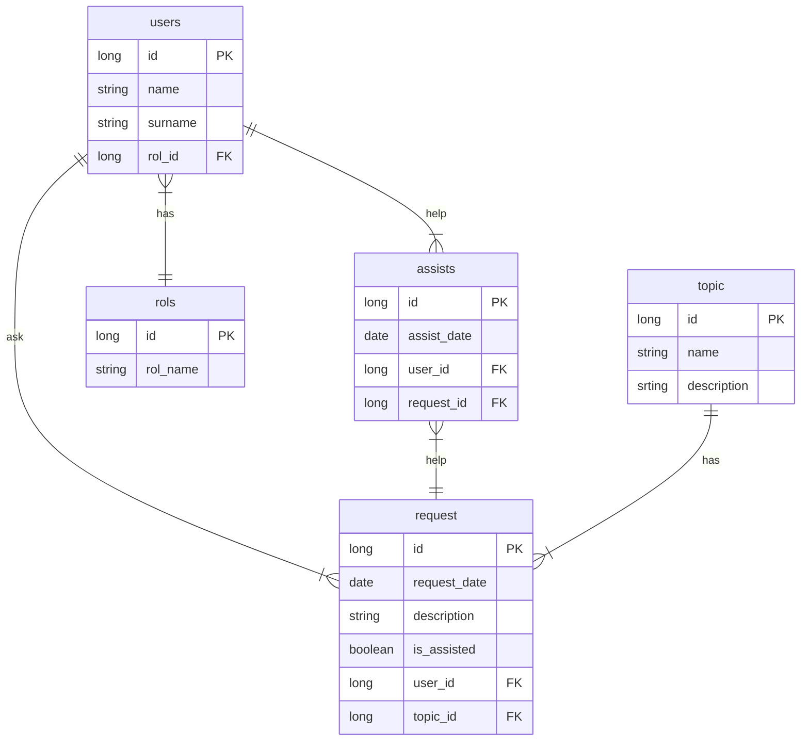
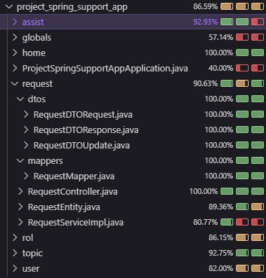
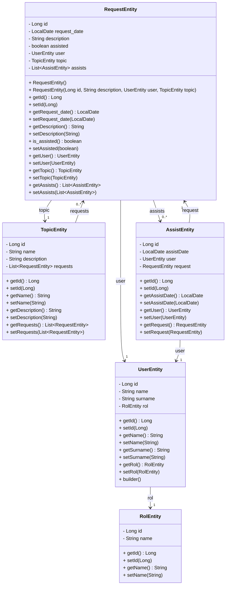

## Diagrama Patas de gallo:

```mermaid
erDiagram
users ||--|{assists : help
users {
  long id PK
  string name
  string surname
  long rol_id FK
}
users }|--|| rols : has
rols {
  long id PK
  string rol_name
}
users ||--|{ request : ask
request {
  long id PK
  date request_date
  string description
  boolean is_assisted
  long user_id FK
  long topic_id FK
}
assists }|--|| request : help
assists {
  long id PK
  date assist_date
  long user_id FK
  long request_id FK
}
topic ||--|{ request : has
topic {
  long id PK
  string name
  srting description
}
```

## Diagrama ER de Chen

## Swagger Documentation

http://localhost:8080/swagger-ui/index.html#/

## Coverage

## UML Diagrams

### Entitys

```mermaid
classDiagram
    class RequestEntity {
        - Long id
        - LocalDate request_date
        - String description
        - boolean assisted
        - UserEntity user
        - TopicEntity topic
        - List~AssistEntity~ assists
        + RequestEntity()
        + RequestEntity(Long id, String description, UserEntity user, TopicEntity topic)
        + getId() Long
        + setId(Long)
        + getRequest_date() LocalDate
        + setRequest_date(LocalDate)
        + getDescription() String
        + setDescription(String)
        + is_assisted() boolean
        + setAssisted(boolean)
        + getUser() UserEntity
        + setUser(UserEntity)
        + getTopic() TopicEntity
        + setTopic(TopicEntity)
        + getAssists() List~AssistEntity~
        + setAssists(List~AssistEntity~)
    }

    class UserEntity
    class TopicEntity
    class AssistEntity

    RequestEntity --> "1" UserEntity : user
    RequestEntity --> "1" TopicEntity : topic
    RequestEntity --> "0..*" AssistEntity : assists

        class UserEntity {
        - Long id
        - String name
        - String surname
        - RolEntity rol
        + getId() Long
        + setId(Long)
        + getName() String
        + setName(String)
        + getSurname() String
        + setSurname(String)
        + getRol() RolEntity
        + setRol(RolEntity)
        + builder()
    }

    class RolEntity {
        - Long id
        - String name
        + getId() Long
        + setId(Long)
        + getName() String
        + setName(String)
    }

    UserEntity --> "1" RolEntity : rol

        class TopicEntity {
        - Long id
        - String name
        - String description
        - List~RequestEntity~ requests
        + getId() Long
        + setId(Long)
        + getName() String
        + setName(String)
        + getDescription() String
        + setDescription(String)
        + getRequests() List~RequestEntity~
        + setRequests(List~RequestEntity~)
    }

    class AssistEntity {
        - Long id
        - LocalDate assistDate
        - UserEntity user
        - RequestEntity request
        + getId() Long
        + setId(Long)
        + getAssistDate() LocalDate
        + setAssistDate(LocalDate)
        + getUser() UserEntity
        + setUser(UserEntity)
        + getRequest() RequestEntity
        + setRequest(RequestEntity)
    }

    class RequestEntity
    class UserEntity

    TopicEntity --> "0..*" RequestEntity : requests
    AssistEntity --> "1" UserEntity : user
    AssistEntity --> "1" RequestEntity : request
```
