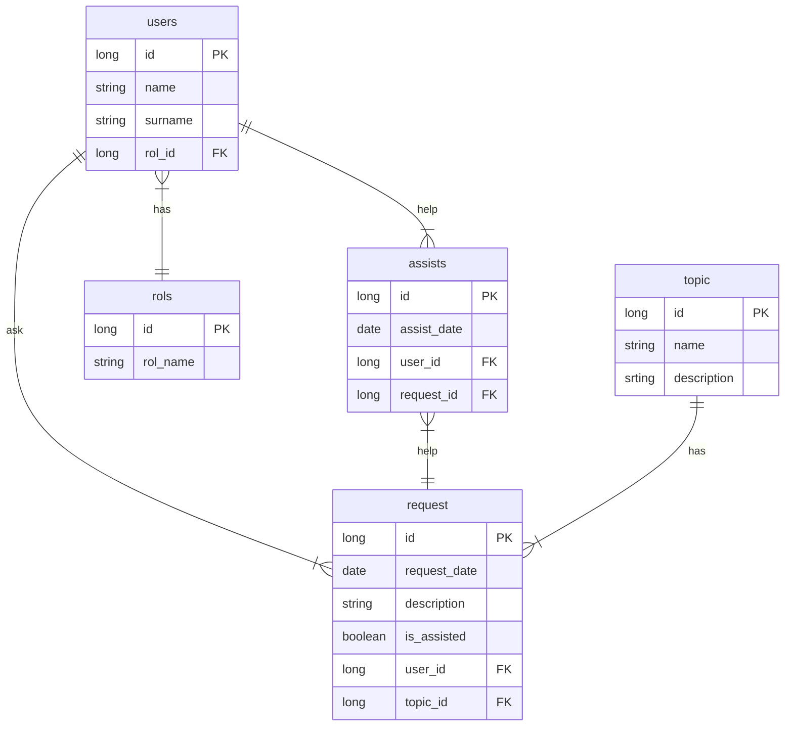
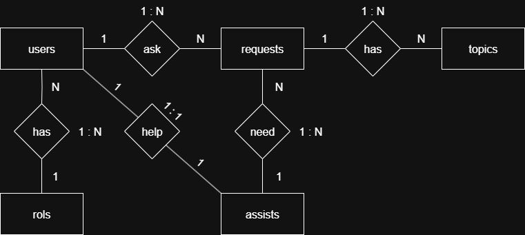
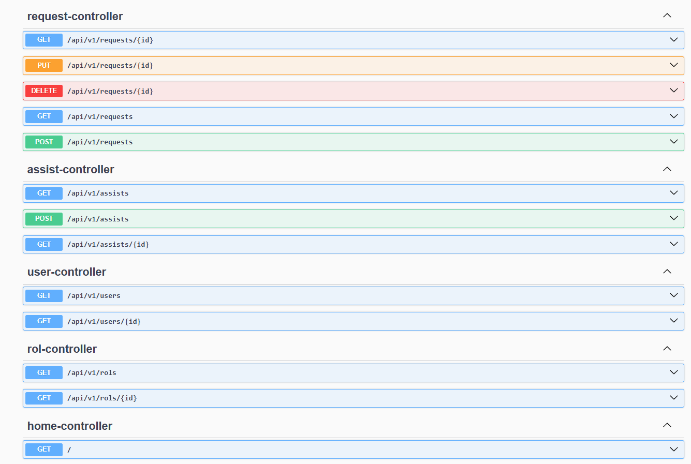

Diagrama Patas de gallo:

```mermaid
erDiagram
users ||--|{assists : help
users {
  long id PK
  string name
  string surname
  long rol_id FK
}
users }|--|| rols : has
rols {
  long id PK
  string rol_name
}
users ||--|{ request : ask
request {
  long id PK
  date request_date
  string description
  boolean is_assisted
  long user_id FK
  long topic_id FK
}
assists }|--|| request : help
assists {
  long id PK
  date assist_date
  long user_id FK
  long request_id FK
}
topic ||--|{ request : has
topic {
  long id PK
  string name
  srting description
}
```

## Diagrama ER de Chen

## Swagger Documentation

http://localhost:8080/swagger-ui/index.html#/
