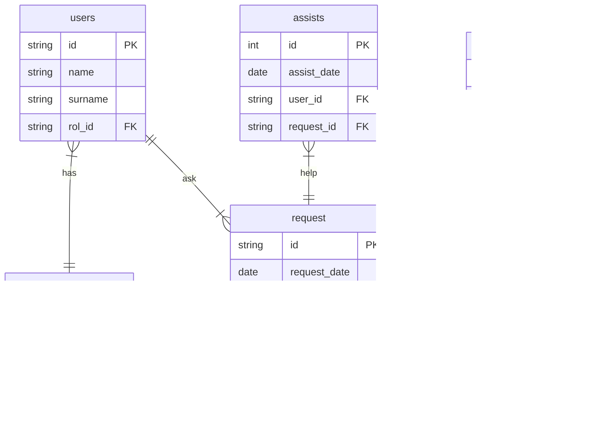

Ejemplo:

```mermaid
erDiagram
users {
  string id PK
  string name
  string surname
  string rol_id FK
}
users }|--|| rols : has
rols {
  string id PK
  string rol_name
}
users ||--|{ request : ask
request {
  string id PK
  date request_date
  string topic
  string description
  boolean is_assisted
  string user_id FK
  string topic_id FK
}
assists }|--|| request : help
assists {
  int id PK
  date assist_date
  string user_id FK
  string request_id FK
}
topic ||--|{ request : has
topic {
  int id PK
  string name
}
```

